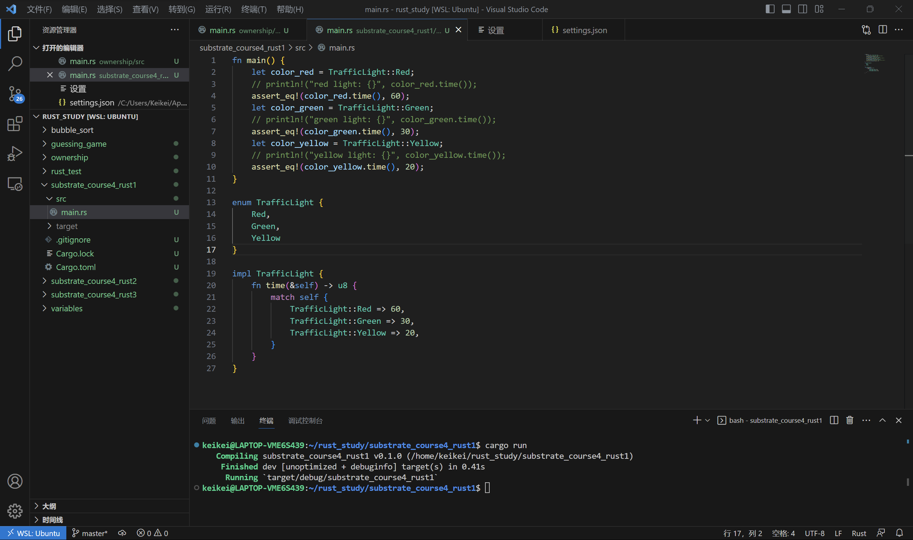

# Substrate第四课作业1

* 为枚举交通信号灯实现一个trait，trait里包含一个返回时间的方法，不同的灯持续的时间不同。

代码：

```rust
fn main() {
    let color_red = TrafficLight::Red;
    // println!("red light: {}", color_red.time());
    assert_eq!(color_red.time(), 60);
    let color_green = TrafficLight::Green;
    // println!("green light: {}", color_green.time());
    assert_eq!(color_green.time(), 30);
    let color_yellow = TrafficLight::Yellow;
    // println!("yellow light: {}", color_yellow.time());
    assert_eq!(color_yellow.time(), 20);
}

enum TrafficLight {
    Red,
    Green,
    Yellow
}

impl TrafficLight {
    fn time(&self) -> u8 {
        match self {
            TrafficLight::Red => 60,
            TrafficLight::Green => 30,
            TrafficLight::Yellow => 20,
        }
    }
}
```


