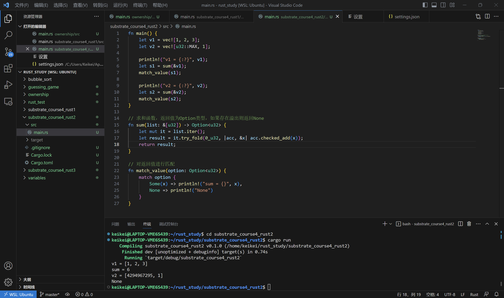

# Substrate第四课作业2

* 实现一个函数，为 u32类型的整数集合求和参数类型为 &[u32]，返回类型为 Option，溢出时返回None;

代码

```rust
fn main() {
    let v1 = vec![1, 2, 3];
    let v2 = vec![u32::MAX, 1];
    
    println!("v1 = {:?}", v1);
    let s1 = sum(&v1);
    match_value(s1);
    
    println!("v2 = {:?}", v2);
    let s2 = sum(&v2);
    match_value(s2);
}

// 求和函数，返回值为Option类型，如果存在溢出则返回None
fn sum(list: &[u32]) -> Option<u32> {
    let mut it = list.iter();
    let result = it.try_fold(0_u32, |acc, &x| acc.checked_add(x));
    return result;
}

// 对返回值进行匹配
fn match_value(option: Option<u32>) {
    match option {
        Some(x) => println!("sum = {}", x),
        None => println!("None")
    }
}
```

