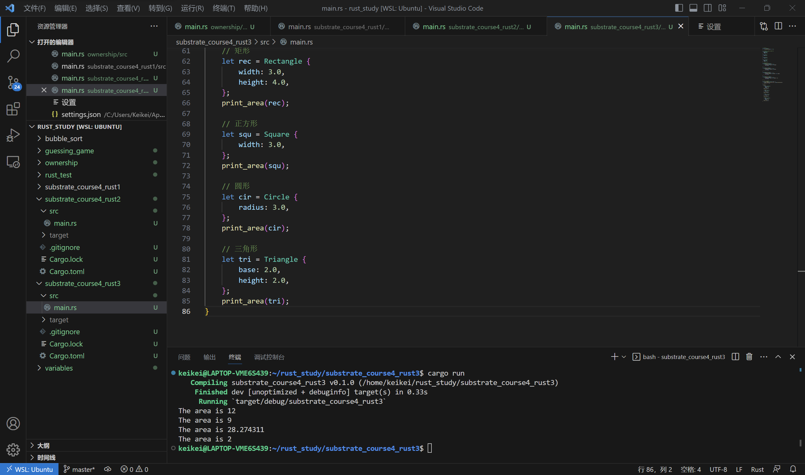

# Substrate第四课作业3

* 实现一个打印图形面积的函数，它接收一个可以计算面积的类型作为参数，比如圆形，三角形正方形，需要用到泛型和泛型约束。

代码：

```rust
// 定义trait
pub trait AreaType {
    fn calculate_area(&self) -> f32;
}

// 定义四种图形计算面积所需要的参数
struct Rectangle {
    width: f32,
    height: f32,
}

struct Square {
    width: f32,
}

struct Circle {
    radius: f32,
}

struct Triangle {
    base: f32,
    height: f32,
}

// 实现对应的trait
impl AreaType for Rectangle {
    fn calculate_area(&self) -> f32 {
        let area = self.width * self.height;
        return area;
    }
}

impl AreaType for Square {
    fn calculate_area(&self) -> f32 {
        let area = self.width * self.width;
        return area;
    }
}

impl AreaType for Circle {
    fn calculate_area(&self) -> f32 {
        let area = 3.14159 * self.radius * self.radius;
        return area;
    }
}

impl AreaType for Triangle {
    fn calculate_area(&self) -> f32 {
        let area = self.base * self.height / 2.0;
        return area;
    }
}

// 打印图形对应的面积
pub fn print_area<T: AreaType>(_type: T) {
    let res = format!("The area is {}", _type.calculate_area());
    println!("{}", res);
}

fn main() {
    // 矩形
    let rec = Rectangle {
        width: 3.0,
        height: 4.0,
    };
    print_area(rec);

    // 正方形
    let squ = Square {
        width: 3.0,
    };
    print_area(squ);

    // 圆形
    let cir = Circle {
        radius: 3.0,
    };
    print_area(cir);

    // 三角形
    let tri = Triangle {
        base: 2.0,
        height: 2.0,
    };
    print_area(tri);
}
```

